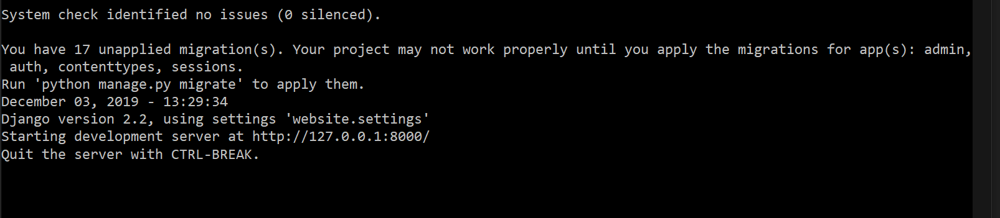
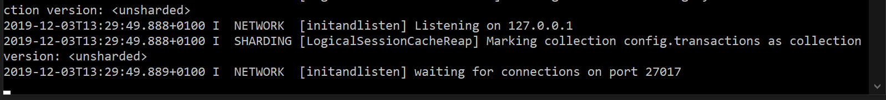

Demo
=====================================
This is a quick Demo for using the website interface of SemlogWeb.

In this demo we would show how to successfully search the image database with the website and train a food classifier.

.. contents:: **Contents**
    :depth: 1
    :local:
    :backlinks: none

Prerequisite
------------
You should first go through all the steps from `Installation Guide <./Installation-Guide.html>`__ and `Quick Start <./Quick-Start.html>`__
to make sure SemlogWeb is successfully deployed in your PC.

Right now you should have two terminal running for Django and MongoDB server.

   Successful terminal state after run ``python manage.py runserver``

   Successful terminal state after run ``mongod``

Use the website
---------------
After you click the **Connect** button on the main page, you should be able to view the search engine of SemLogWeb.

.. figure:: images/website1.png
   :width: 600
   :align: center

   A screen shot for the search engine

1. Choose collections
~~~~~~~~~~~~~~~~~~~~~~
Although we can leave this input field blank to search for all available collections, in order to speed up the process,
we would only search for one collection.

For example **Food.f_in_drawers_1**.

2. Add objects
~~~~~~~~~~~~~~
Add two class names to search for all images containing at least one of these class objects.

For example **MPWatermelon** and **MPBreadPizza**.

3. Dataset preparation
~~~~~~~~~~~~~~~~~~~~~~
Right now in this library we support two kinds of datasets.

The first is full images with coordinates of bounding boxes, which
can be used to train object detection algorithms such as `SSD <https://arxiv.org/abs/1512.02325>`_, `YOLO <https://arxiv.org/abs/1506.02640>`_, or `Mask-RCNN <https://arxiv.org/abs/1703.06870>`_.

The second is cropped objects based on our inputs. We use such dataset to train our image classifier.

Click **Multiclass Classifier**.

Image postprocessing
--------------------
After target objects and dataset types are selected, we can choose to customize the image resolution and image types that are needed.

After objects are cropped from the original image, the resolutions of all cropped images are varying. By applying image postprocessing, we make sure all images are convert to the size resolution for further training.

1. Resize image
~~~~~~~~~~~~~~~
For this demo, input 80 for width and 80 for height to stretch all cropped images to share the same resolution.

2. Image type
~~~~~~~~~~~~~~
Two mandatory types are RGB and Mask. You can also select more types for other purposes. SemloWeb will automatically arrange the display layout.

Click the **Search** button to start query and create the dataset.

Options after searching
-----------------------
You can select different options for using our datasets. After the server finished searching, you can click three buttons.

Download
~~~~~~~~~
If you only need the dataset and want to do other processing by yourself, you can click **Download** button to retrieve the full dataset from the server.

View
~~~~~
You can click **View** to view the result images on the website conveniently.

.. figure:: images/gallery.png
   :width: 600
   :align: center

   A screen shot for the result images

Click the image to view the 3D point cloud as long as you selected Depth image type before. Click the little label on top left to view the image in original resolution.

.. figure:: images/pointcloud.png
   :width: 600
   :align: center

   A screen shot for the point cloud

Click **Bounding box/Scans** to view cropped images.

Train
~~~~~

In order to monitor relevant metrics during the training stage, we have embedded the website with Visdom.

Open a new terminal, enter

   .. code::

     visdom

to run the visdom server.

All preparations are finished right now. Click **Train** and visit ``localhost:8097`` to check the training process!

.. figure:: images/visdom.png
   :width: 600
   :align: center

   A screen shot for Visdom visualization

